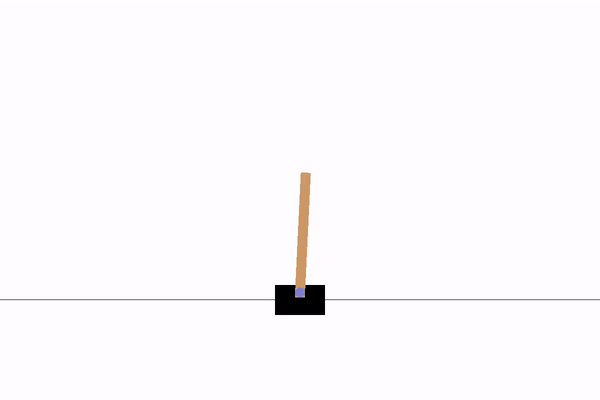

# sota_dqn

sota_dqn is an opinionated batteries included deep Q network library focused on productive implementation of models.

# Installation
The recommended method of installing sota-dqn is as a github repo.
```
git clone https://github.com/LukeWood/sota-dqn.git &&
cd sota-dqn && 
pip install -r requirements.txt .
```

# Quickstart
Batteries included examples are held in `examples/`.
The quickest example to get started with is `CartPole-v1`.

You can train a model for yourself quickly.

```
python examples/dqn_train.py
```

After the first checkpoint is saved you can test the model.

```
python examples/dqn_inference.py
```


Cartpole-V1 example gif
