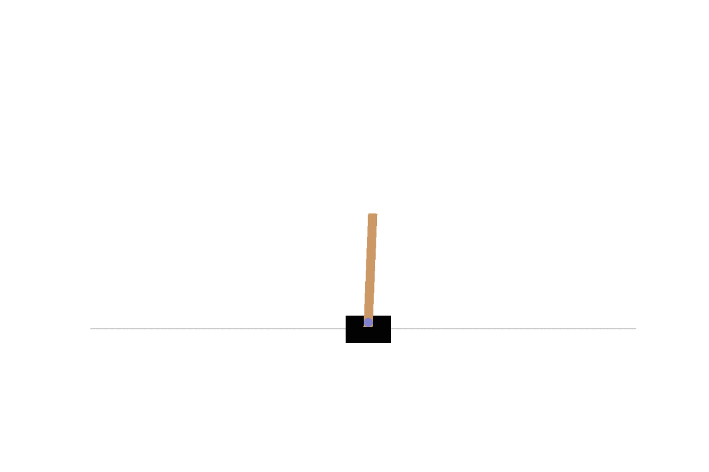
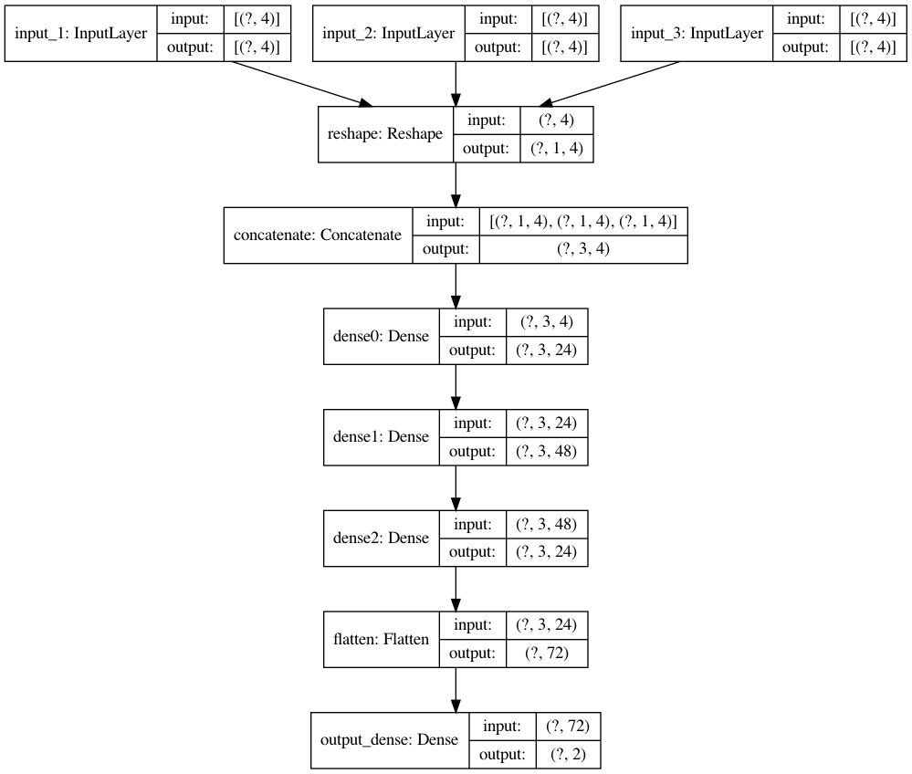
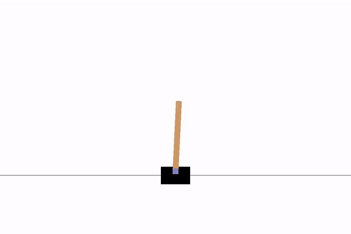

# State of the Art Deep Q Networks

sota_dqn is an opinionated deep Q network library focused on productive implementation.

sota_dqn makes state of the art Reinforcement Learning easy and productive to use.
Methods such as [Prioritized Experience Replay](https://arxiv.org/abs/1511.05952) and fixed q target training are implemented by default.

Other methods are under consideration for implementation such as:
- https://cs.brown.edu/people/kasadiat/pdf/deep_mellow.pdf
- https://www.hindawi.com/journals/mpe/2018/2129393/abs/
- [Hindsight Experience Replay](http://papers.nips.cc/paper/7090-hindsight-experience-replay) are exposed through simple to use interfaces.


# Overview
## Goals
- Provide a sound api to interact with state of the art deep Q learning
- Abstract where necessary without over-abstracting.  This is not a library for those without knowledge of DQN architecture

## Non-Goals
- Provide a complete deep Q learning api. 
- one liners for dqn models (i.e. `rainbow = RainbowModel(env=env)`)

## Examples
- [basic DQN](examples/basic/)
- [CNN on Image Inputs](examples/cnn/)

# Installation
sota_dqn is published on pypi by a CI/CD workflow
```
pip install sota_dqn
```

sota_dqn can also be installed as a git repo:
```
git clone https://github.com/LukeWood/sota-dqn.git &&
cd sota-dqn && 
pip install -r requirements.txt .
```

# Quickstart
Batteries included examples held in `examples/`.

## Cartpole
The quickest example to get started with is the [basic](examples/basic) which uses the `CartPole-v1` environment.



_Cartpole-V1 before training_

You can train a model for yourself quickly.

The model has the following architecture:



This is created by the [training script](examples/basic/train.py).

```
python examples/basic/dqn_train.py
```

After the first checkpoint is saved you can test the model.

```
python examples/basic/dqn_inference.py
```



_Cartpole-V1 after training_

## Ms Pacman
This example builds on on the foundations set in the basic example.
In the Ms Pacman example the raw image data is returned from the environment at each step.
Preprocessing converts the images to gray scale to reduce the dimensionality of the input space.

On top of this a convolutional model with the following architecture is used:


_A GPU is highly recommended for training this model_.
