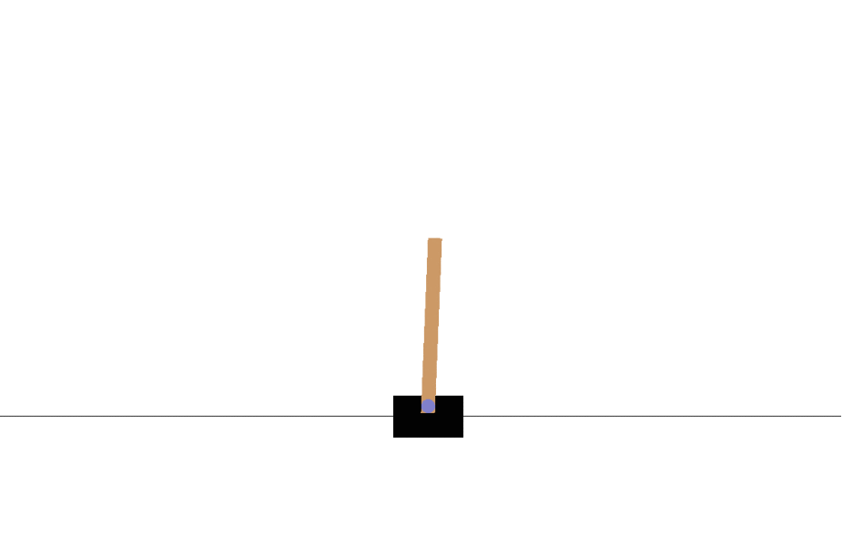

# sota_dqn
## State of the Art Deep Q Networks

sota_dqn is an opinionated batteries included deep Q network library focused on productive implementation of models.


sota_dqn attempts to make state of the art Reinforcement Learning easily accessible and productive to use.
Methods such as [Prioritized Experience Replay](https://arxiv.org/abs/1511.05952) and fixed q target training are implemented by default.

Other methods are eration for implementation such as:
- https://cs.brown.edu/people/kasadiat/pdf/deep_mellow.pdf
- https://www.hindawi.com/journals/mpe/2018/2129393/abs/
- [Hindsight Experience Replay](http://papers.nips.cc/paper/7090-hindsight-experience-replay) are exposed through simple to use interfaces.

## Installation
sota_dqn is published on pypi by a CI/CD workflow
```
pip install sota_dqn
```

sota_dqn can also be installed as a git repo:
```
git clone https://github.com/LukeWood/sota-dqn.git &&
cd sota-dqn && 
pip install -r requirements.txt .
```

## Quickstart
Batteries included examples are held in `examples/`.
The quickest example to get started with is `CartPole-v1`.



_Cartpole-V1 before training_

You can train a model for yourself quickly.

```
python examples/dqn_train.py
```

After the first checkpoint is saved you can test the model.

```
python examples/dqn_inference.py
```


_Trained Cartpole-V1 after training_

